# Build and debug SEQURE_G431 in Renode with VS Code on Windows

This guide takes a fresh VS Code setup through building the **SEQURE_G431** ARM firmware, debugging it in Renode, controlling its inputs, and viewing the DHO804 virtual scope. It uses the combined Windows installer and requires no physical ESC or debug probe.

**Renode executes the target's ARM firmware on an emulated microcontroller.** For the faster host-compiled simulator, use the [SITL guide](windows-vscode-sitl.md). The SEQURE_G431 firmware uses its ordinary AM32 sources; no ESCSim-specific firmware patch or upstream PR is needed.

The screenshots were captured on Windows 11 with a separate AM32 checkout and VS Code profile. Your directories and theme may differ. If you already completed the common setup in the SITL guide, skip to [step 6](#6-select-the-renode-debugger-and-build).

## 1. Install VS Code and Git

Use Windows 11, 64-bit. Download the [VS Code Windows User Installer](https://code.visualstudio.com/docs/setup/windows) and [Git for Windows](https://git-scm.com/downloads/win). Run both installers. Keep **Add to PATH** enabled, then open a new VS Code window so it sees the updated PATH.

At VS Code's welcome screen, **Continue without Signing In** is sufficient. Choose a theme and **Get Started**. A GitHub account, Copilot subscription, Visual Studio, and hardware debug probe are not required.

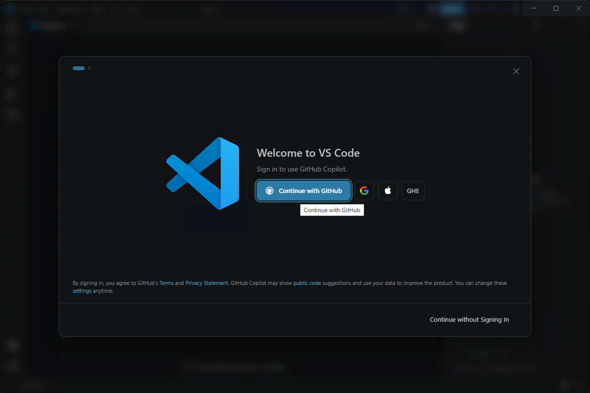

Press **Ctrl+Shift+X**, search for `ms-vscode.cpptools`, select **C/C++** published by **Microsoft**, and click **Install**. Use the stable extension. Its welcome page also describes MSVC setup; the AM32 toolchains installed below supply the compilers for this guide.

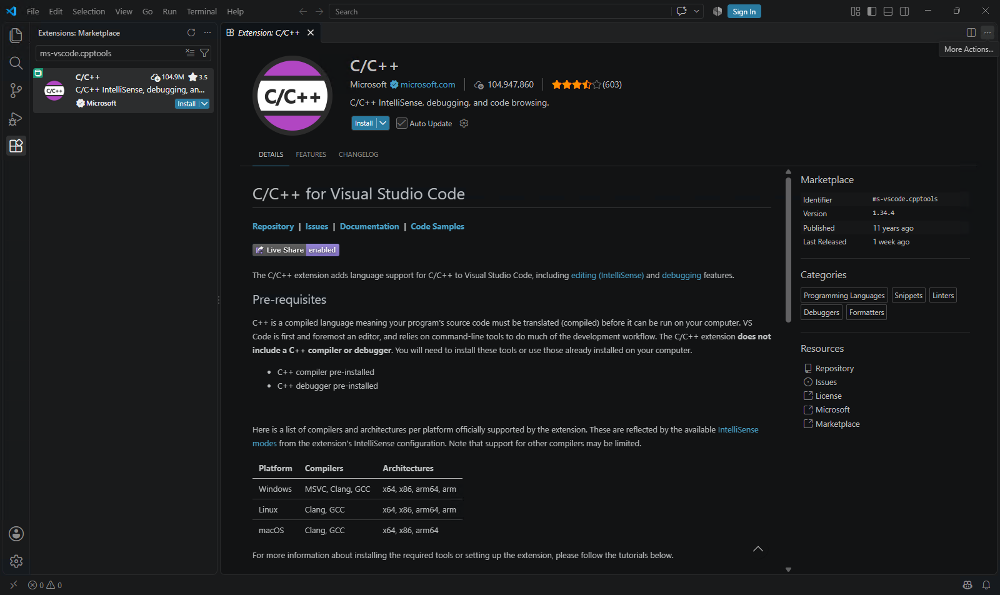

## 2. Install ESCSim

Download **ESCSim-installer.exe** from the [ESCSim releases page](https://github.com/am32-firmware/ESCSim/releases). This one installer includes both backends.

Run it and choose the installation directory. The default is `%LOCALAPPDATA%\Programs\ESCSim`; an upgrade remembers the previous directory. **Browse…** lets you choose another folder. The paths in these screenshots are examples, not required locations.

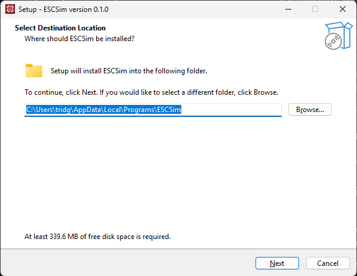

Leave **Create both desktop launchers** selected, then finish the installation. The shortcuts are **ESCSim SITL** and **ESCSim Renode**. The Start menu also contains **Configure ESCSim for VS Code**.

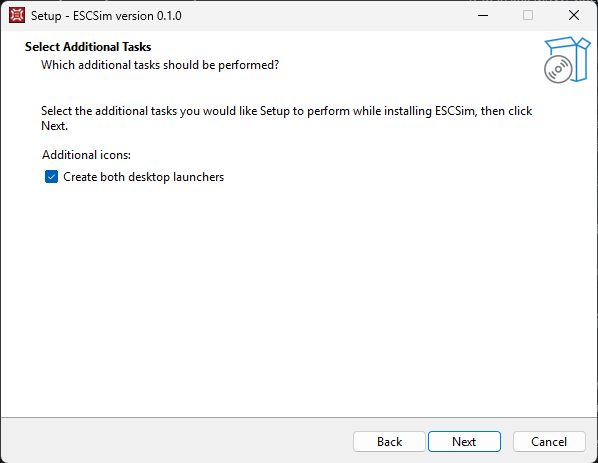

The optional USB/IP driver is for connecting a configurator through virtual USB. It is not needed for the debugger, DShot input, motor controls, or scope used here. The installed applications include Python and their GUI dependencies; firmware development additionally needs the tools in step 4.

## 3. Get the firmware sources

In VS Code, open **Terminal > New Terminal** and use a **PowerShell** terminal. Clone AM32 into a writable location, preferably a short path without spaces. For example:

```powershell
git clone https://github.com/am32-firmware/AM32.git C:\src\AM32
```

If `C:\src` is not writable, choose a folder you own. Existing AM32 users can use their current checkout instead of cloning again. All subsequent commands run from the root of that checkout, containing `Inc`, `Src`, and `Makefile`.

Use **File > Open Folder…** to open the AM32 folder. Trust this checkout when prompted so VS Code can run its build tasks. If the window remains in Restricted Mode, run **Workspaces: Manage Workspace Trust** from **Ctrl+Shift+P**, then click **Trust** for this folder.

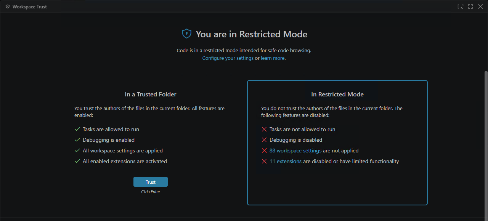

Confirm the source with `git remote -v`. The screenshots use a separate demonstration checkout; substitute your own path throughout.

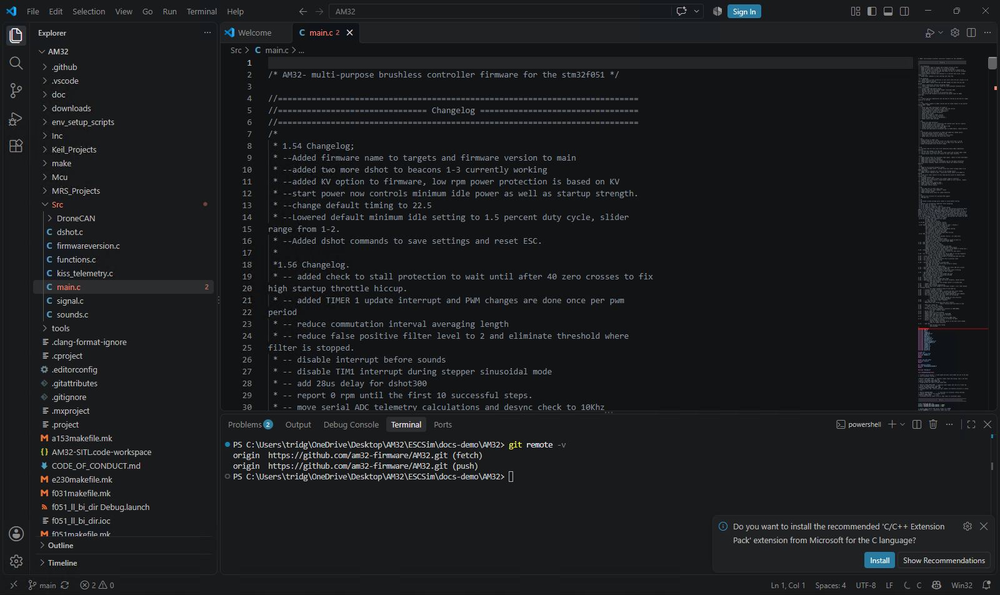

## 4. Install and verify the firmware toolchains

In **Terminal > New Terminal**, run these commands from the AM32 folder:

```powershell
.\env_setup_scripts\gcc_windows_env_setup.cmd
.\env_setup_scripts\sitl_setup_windows.cmd
```

Wait for each command to finish successfully. The first downloads the ARM compiler and GDB into `tools\windows`. The second installs or detects Cygwin's host compiler, Make, and GDB, then records its location in `build\sitl-cygwin-root.txt`. On a fresh machine its usual per-user location is `%LOCALAPPDATA%\AM32-Tools\cygwin64`; an existing `C:\cygwin64` may be reused.

For an existing checkout, save any custom `.vscode/settings.json` before running the ARM setup script: that upstream script replaces it. ESCSim's workspace generator itself preserves the `.vscode` directory.

The Cygwin installation also needs **python3**. If it is missing, run the official [Cygwin setup program](https://cygwin.com/install.html) again, select the **same installation root**, and add the `python3` package. Keep existing packages selected. For a per-user installation, launch the setup program with `--no-admin`. Windows Store Python alone does not satisfy this requirement.

Verify the tools in PowerShell:

```powershell
$cygwin = (Get-Content .\build\sitl-cygwin-root.txt -Raw).Trim()
$cygwin
& "$cygwin\bin\bash.exe" --noprofile --norc -c 'export PATH=/usr/bin:/bin:$PATH; gcc --version; gdb --version; make --version; python3 --version'
& .\tools\windows\xpack-arm-none-eabi-gcc-10.3.1-2.3\bin\arm-none-eabi-gdb.exe --version
```

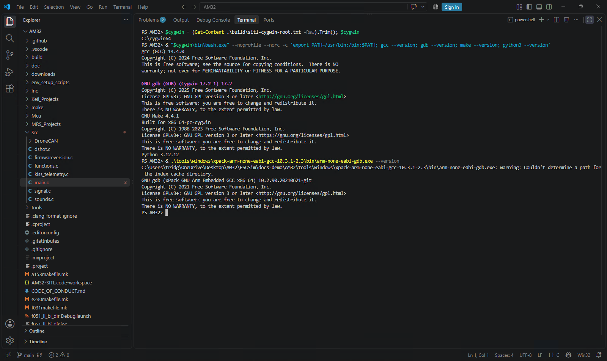

The C/C++ extension may show include/define diagnostics before IntelliSense is configured for your target. These are separate from the build: use the task Terminal output to determine whether compilation succeeded. This guide sets up building and debugging; it does not generate a full IntelliSense configuration.

The generated workspace contains **both** backends and currently checks for both toolchains, even if you intend to use only one. Use Cygwin GCC and its matching GDB for SITL; use ARM GDB for Renode.

## 5. Create and open the ESCSim workspace

Open **Configure ESCSim for VS Code** from the Windows Start menu. Select the AM32 **source folder**, enter **SEQURE_G431** at the firmware-target prompt, and enter the Cygwin root printed in step 4. The default target is a different board, so type the target explicitly.

You can also run the equivalent command in the VS Code PowerShell terminal. Set `$installDir` to the folder you chose in step 2:

```powershell
$installDir = "$env:LOCALAPPDATA\Programs\ESCSim"
& "$installDir\ESCSim-cli.exe" debug workspace `
  --repo "$PWD" --target SEQURE_G431 --cygwin "$cygwin"
```

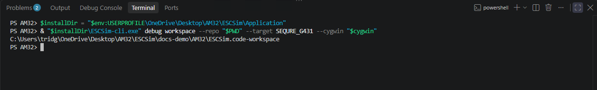

This creates **ESCSim.code-workspace** in the AM32 folder. Use **File > Open Workspace from File…** to open it. Opening just the folder, or opening upstream `AM32-SITL.code-workspace`, gives a different set of menus.

The generator adds **ESCSim SITL**, **ESCSim Renode**, and their build/control tasks. These entries come from ESCSim; no AM32 firmware patch or PR is required. Keep this generated workspace local because it contains your tool and installation paths.

If the workspace already exists, the generator leaves it intact. To regenerate it after moving the app, checkout, or tools, rerun the terminal command with `--force`. That replaces only `ESCSim.code-workspace`. For a nonstandard ARM toolchain, add `--arm-gdb "C:\your\toolchain\bin\arm-none-eabi-gdb.exe"`.

## 6. Select the Renode debugger and build

Press **Ctrl+Shift+D** to open **Run and Debug**. Select **ESCSim Renode** in the configuration dropdown and press **F5**.

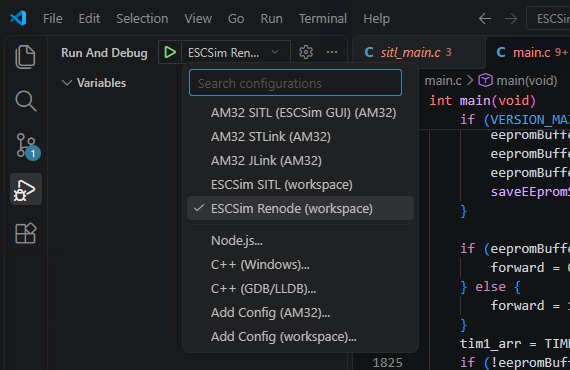

VS Code runs **ESCSim: Build Renode**, building `SEQURE_G431` from your current checkout. The ELF used by the debugger is **build\escsim-renode\firmware.elf**. It then starts Renode and attaches ARM GDB. The first run may take longer while ESCSim downloads the verified Renode runtime; allow the task to finish.

The debugger loads that ELF directly, without a hardware bootloader or a simulated flight controller. It does not use the ELF, bootloader, or FlightController fields previously selected in the desktop ESCSim Renode Target tab. Your normal `obj\AM32_SEQURE_G431_*.elf` is left alone.

To build without starting the debugger, use **Terminal > Run Task… > ESCSim: Build Renode**. Check the Terminal for compiler errors before proceeding.

## 7. Reach your first source breakpoint

The initial connection stops at the reset vector, usually shown as **Reset_Handler** in startup assembly. This is expected.

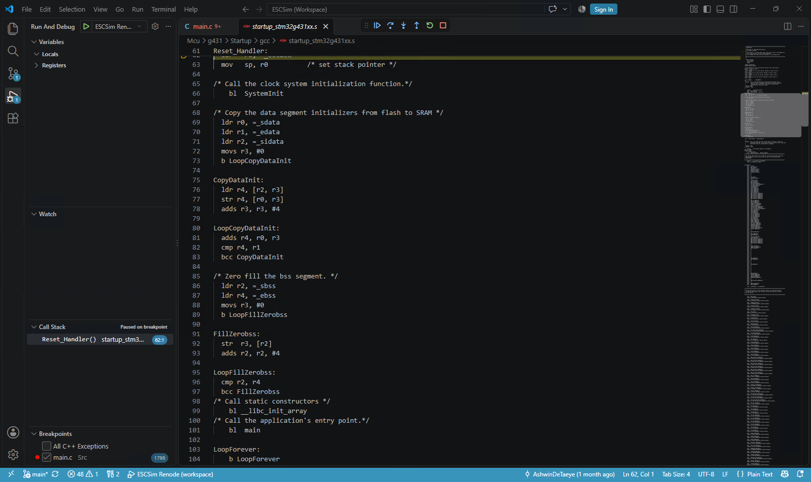

Open `Src\main.c` with **Ctrl+P**, find `main`, and click the gutter beside its first executable statement to set a breakpoint. Alternatively, add a **Function Breakpoint** named `main` in the BREAKPOINTS section.

Press **F5** to Continue. Execution stops at your firmware's `main`.

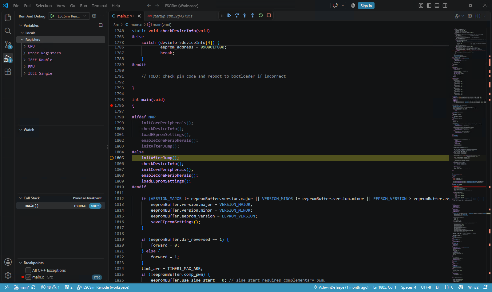

Use **F10** to step over, **F11** to step into, and **Shift+F11** to step out. Inspect **VARIABLES**, add expressions to **WATCH**, or hover over a variable. Expand the debugger's register view when needed. In **DEBUG CONSOLE**, GDB commands can be issued with `-exec`, for example:

```text
-exec info registers
-exec x/16wx 0x20000000
```

Optimised firmware can have unavailable locals or source lines that do not map one-to-one to instructions. Check the loaded source and build output before interpreting an unresolved breakpoint as an emulator problem.

Disable the startup breakpoint when you are ready to run the motor. Pausing the debugger pauses emulated time and the scope's incoming samples.

## 8. Drive inputs with Renode motor controls

Choose **Terminal > Run Task… > ESCSim: Renode motor controls**. It opens **AM32 Renode control**, attached to the debugger's emulator.

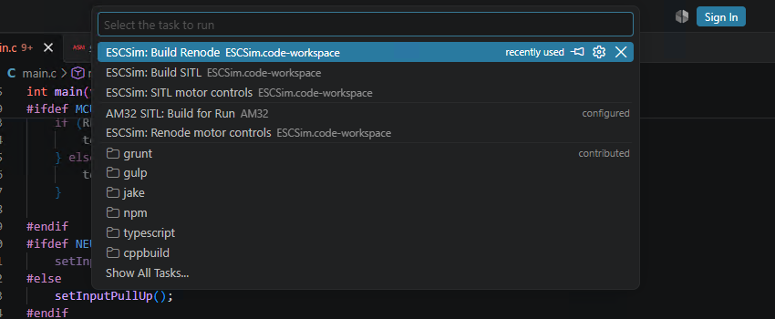

In **PWM / DShot**, choose **DShot300**, leave the input value at **0**, and tick **Enable**. Continue the debugger. Wait for the startup tones and the control window's firmware status to report **armed**, then raise the DShot value gradually, for example to **300**.

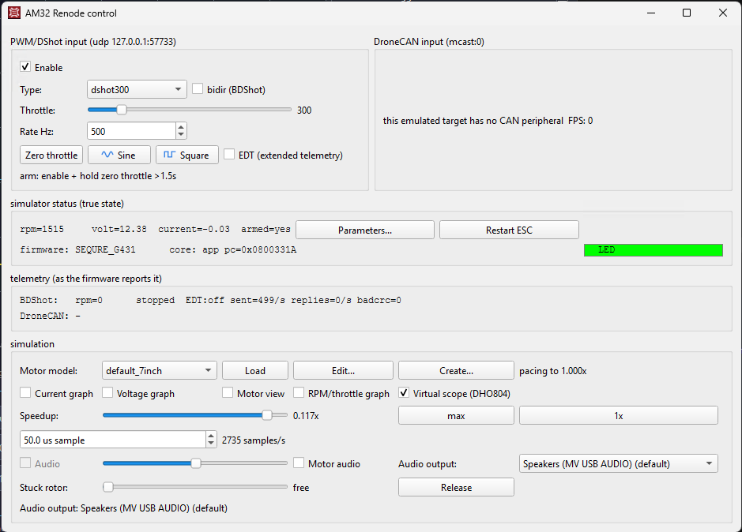

Arming takes simulated time. Renode may run substantially slower than real time on your PC, so wait for the reported state instead of using a fixed wall-clock delay. The scope's Fine capture mode slows it further; arm at ordinary speed first.

Use **Renode motor controls** for this session. The desktop **ESCSim Renode** launcher supports standalone runs, but its Start button would launch a separate emulator. Leave it stopped while debugging. The SITL controls task is for the other backend.

The generated workspace uses **3333** for GDB, **3334** for the Renode monitor, and **57733/57734** for input/state. Run one session at a time. Firmware input and the model continue through the same control UI while VS Code owns execution and breakpoints.

## 9. Use the DHO804 virtual scope

In the controls' **Simulation** section, tick **Virtual scope (DHO804)**. This opens the separate four-channel instrument window. **Current graph** and **Voltage graph** are simpler plots and do not open the DHO804.

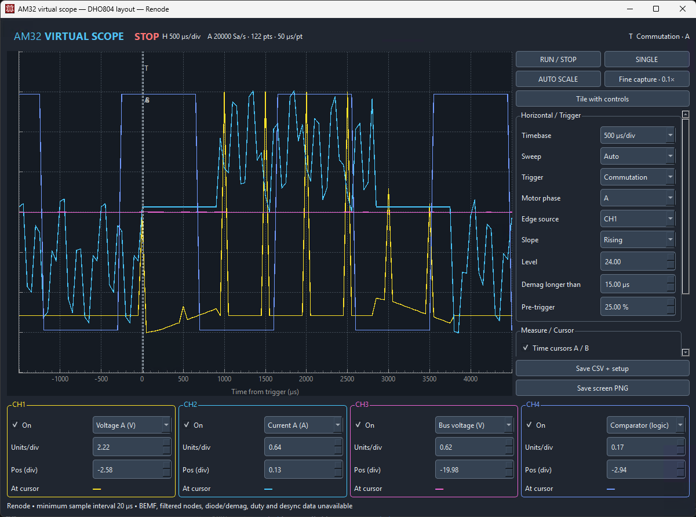

The Renode scope starts in **Auto** sweep, so traces can appear before the motor commutates. Choose phase voltages or currents for the channels, click **Auto Scale**, and adjust the timebase. Once the motor runs, try a **Commutation** trigger or an **Edge** trigger on a selected channel.

**Run/Stop** freezes scope acquisition; **Single** waits for one triggered capture. A/B cursors and CSV/PNG export are available, and setup JSON stores instrument settings. A stopped scope does not stop the emulator; use VS Code's pause/stop controls for that.

Renode provides phase voltages/currents, bus voltage/current, virtual neutral, and comparator logic. Its samples are instantaneous and limited to **20 µs or coarser**. **Fine capture** requests 20 µs samples and **0.1×** speed. It cannot resolve individual PWM edges as finely as SITL's 0.5 µs capture. BEMF, filtered-node, diode/demagnetisation, duty, and firmware-desync signals are unavailable in this stream; their controls are disabled.

The scope stops receiving new samples at a firmware breakpoint. Press **F5** to Continue before expecting a trigger or updated trace.

## 10. Stop, edit, and repeat

Return throttle to **0** and press **Shift+F5** in VS Code. Stopping the debug session also stops its Renode emulator. Close motor controls and the scope when finished. Edit your firmware and press **F5** again to rebuild and debug the new ELF.

If you switch to another ARM target, regenerate the workspace with the desired target, then reopen it. These generated configurations use the ARM toolchain; a RISC-V target needs a matching toolchain and debugger configuration.

## Troubleshooting

| Symptom | Check |
|---|---|
| ESCSim Renode is absent | Open **ESCSim.code-workspace**, trust it, and install Microsoft C/C++. |
| Workspace generation fails on missing tools | Complete step 4, including Cygwin `python3` and the ARM compiler/GDB. |
| F5 uses the wrong firmware | The workspace builds `--target SEQURE_G431` into `build/escsim-renode`; the desktop Target tab does not select the debugger's ELF. Regenerate the workspace if necessary. |
| Debugger initially shows assembly | The reset-vector stop is expected. Set a breakpoint in `main` and Continue. |
| First launch takes a long time | Check Terminal/Debug Console for the Renode download and build progress. Internet access is required for the first runtime download. |
| Source-line breakpoint remains hollow | Update ESCSim and regenerate the workspace with `--force`. Older workspaces incorrectly apply a Cygwin source map to the native ARM debugger. |
| GDB connection or address-in-use error | Stop the previous debug session and any standalone simulator using the default ports. |
| Motor never arms | Continue execution, enable zero-throttle DShot, and wait for the **armed** status in simulated time. |
| Scope is blank or waiting | Continue execution and use Auto sweep; verify that **Virtual scope (DHO804)** is checked and samples are arriving. |
| Some scope signals are disabled | Those signals are unavailable in Renode's telemetry; see step 9 for supported channels. |
| `TemporaryFilesManager` fails with Access denied | Install the current ESCSim release; it isolates Renode's temporary files on Windows. Close old ESCSim/debug sessions before upgrading. |
| An upgrade cannot replace the executable | Stop debugging and close ESCSim motor controls and the scope, then rerun the installer. |

See also the [SITL walkthrough](windows-vscode-sitl.md), [standalone quick start](quickstart.md), and [Windows validation record](windows-testing.md).
