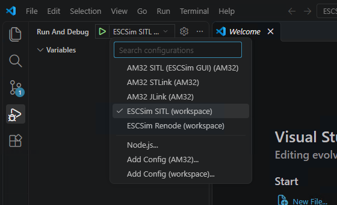
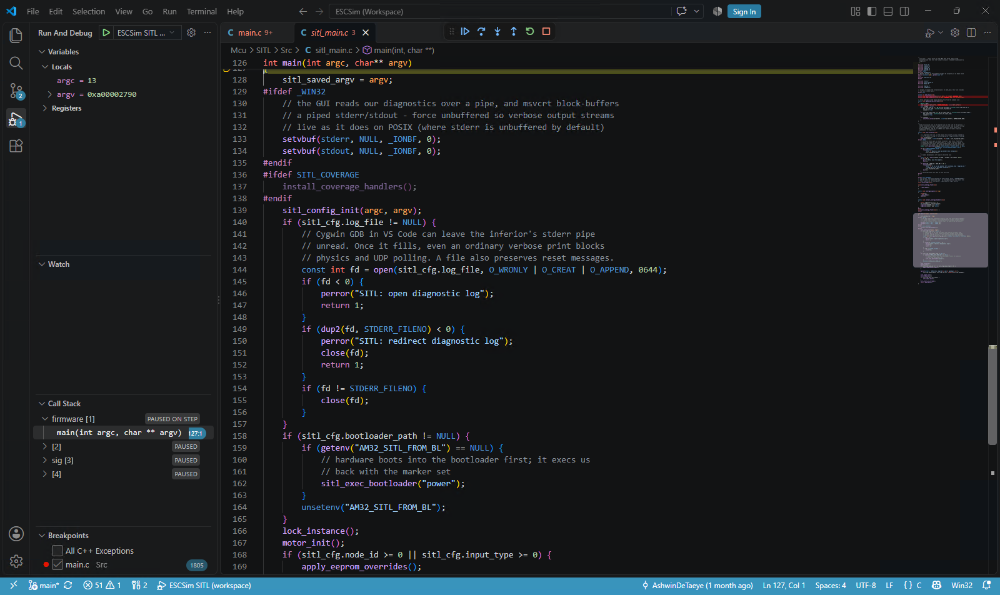
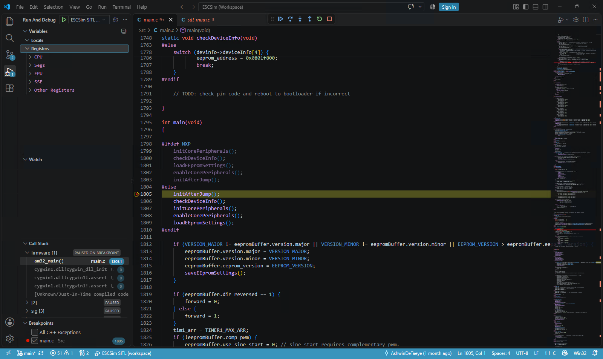
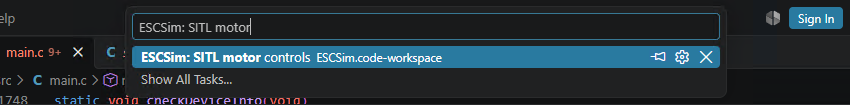
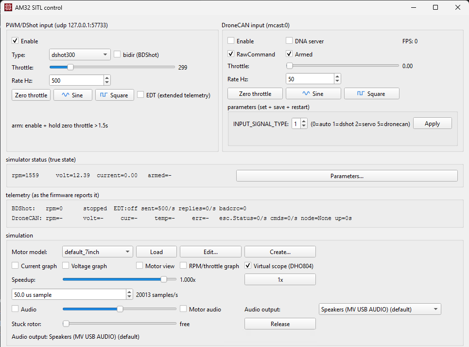
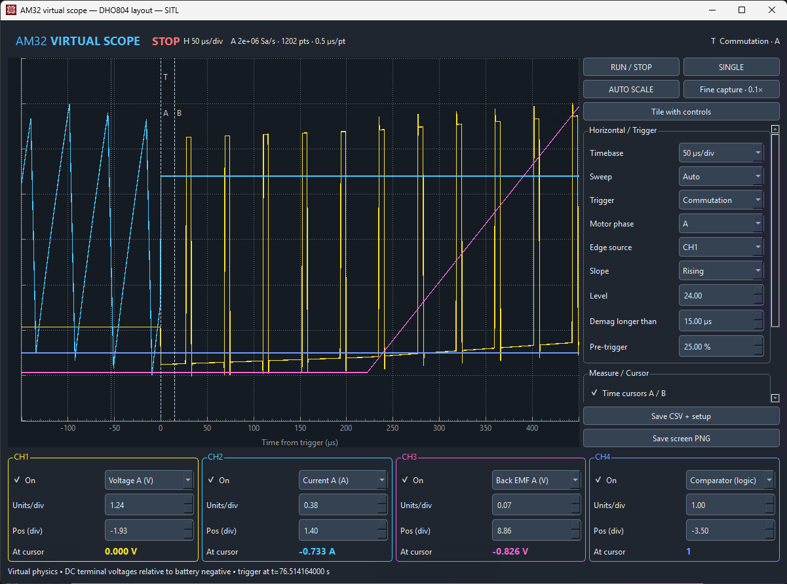

# Build and debug AM32 SITL in VS Code on Windows

This guide takes a fresh VS Code setup through building AM32, stopping at a source breakpoint, controlling the simulated motor, and opening the DHO804 virtual scope. The Windows installer provides both ESCSim applications.

**SITL runs AM32 code compiled as a Windows host program.** It is useful for fast firmware logic and motor-model work. Selecting `SEQURE_G431` when creating the shared workspace configures its Renode entry; the SITL build still uses `AM32_SITL_CAN`. To execute the actual SEQURE_G431 ARM firmware and peripherals, follow the [Renode guide](windows-vscode-renode.md).

The screenshots were captured on Windows 11 with a separate AM32 checkout and VS Code profile. Your username, chosen directories, and theme may differ. If you already completed the common setup in the Renode guide, skip to [step 6](#6-select-the-sitl-debugger-and-build).

## 1. Install VS Code and Git

Use Windows 11, 64-bit. Download the [VS Code Windows User Installer](https://code.visualstudio.com/docs/setup/windows) and [Git for Windows](https://git-scm.com/downloads/win). Run both installers. Keep **Add to PATH** enabled, then open a new VS Code window so it sees the updated PATH.

At VS Code's welcome screen, **Continue without Signing In** is sufficient. Choose a theme and **Get Started**. A GitHub account, Copilot subscription, Visual Studio, and hardware debug probe are not required.


Press **Ctrl+Shift+X**, search for `ms-vscode.cpptools`, select **C/C++** published by **Microsoft**, and click **Install**. Use the stable extension. Its welcome page also describes MSVC setup; the AM32 toolchains installed below supply the compilers for this guide.


## 2. Install ESCSim

Download **ESCSim-installer.exe** from the [ESCSim releases page](https://github.com/am32-firmware/ESCSim/releases). This one installer includes both backends.

Run it and choose the installation directory. The default is `%LOCALAPPDATA%\Programs\ESCSim`; an upgrade remembers the previous directory. **Browse…** lets you choose another folder. The paths in these screenshots are examples, not required locations.


Leave **Create both desktop launchers** selected, then finish the installation. The shortcuts are **ESCSim SITL** and **ESCSim Renode**. The Start menu also contains **Configure ESCSim for VS Code**.


The optional USB/IP driver is for connecting a configurator through virtual USB. It is not needed for the debugger, DShot input, motor controls, or scope used here. The installed applications include Python and their GUI dependencies; firmware development additionally needs the tools in step 4.

## 3. Get the firmware sources

In VS Code, open **Terminal > New Terminal** and use a **PowerShell** terminal. Clone AM32 into a writable location, preferably a short path without spaces. For example:

```powershell
git clone https://github.com/am32-firmware/AM32.git C:\src\AM32
```

If `C:\src` is not writable, choose a folder you own. Existing AM32 users can use their current checkout instead of cloning again. All subsequent commands run from the root of that checkout, containing `Inc`, `Src`, and `Makefile`.

Use **File > Open Folder…** to open the AM32 folder. Trust this checkout when prompted so VS Code can run its build tasks. If the window remains in Restricted Mode, run **Workspaces: Manage Workspace Trust** from **Ctrl+Shift+P**, then click **Trust** for this folder.


Confirm the source with `git remote -v`. The screenshots use a separate demonstration checkout; substitute your own path throughout.


## 4. Install and verify the firmware toolchains

In **Terminal > New Terminal**, run these commands from the AM32 folder:

```powershell
.\env_setup_scripts\gcc_windows_env_setup.cmd
.\env_setup_scripts\sitl_setup_windows.cmd
```

Wait for each command to finish successfully. The first downloads the ARM compiler and GDB into `tools\windows`. The second installs or detects Cygwin's host compiler, Make, and GDB, then records its location in `build\sitl-cygwin-root.txt`. On a fresh machine its usual per-user location is `%LOCALAPPDATA%\AM32-Tools\cygwin64`; an existing `C:\cygwin64` may be reused.

For an existing checkout, save any custom `.vscode/settings.json` before running the ARM setup script: that upstream script replaces it. ESCSim's workspace generator itself preserves the `.vscode` directory.

The Cygwin installation also needs **python3**. If it is missing, run the official [Cygwin setup program](https://cygwin.com/install.html) again, select the **same installation root**, and add the `python3` package. Keep existing packages selected. For a per-user installation, launch the setup program with `--no-admin`. Windows Store Python alone does not satisfy this requirement.

Verify the tools in PowerShell:

```powershell
$cygwin = (Get-Content .\build\sitl-cygwin-root.txt -Raw).Trim()
$cygwin
& "$cygwin\bin\bash.exe" --noprofile --norc -c 'export PATH=/usr/bin:/bin:$PATH; gcc --version; gdb --version; make --version; python3 --version'
& .\tools\windows\xpack-arm-none-eabi-gcc-10.3.1-2.3\bin\arm-none-eabi-gdb.exe --version
```


The C/C++ extension may show include/define diagnostics before IntelliSense is configured for your target. These are separate from the build: use the task Terminal output to determine whether compilation succeeded. This guide sets up building and debugging; it does not generate a full IntelliSense configuration.

The generated workspace contains **both** backends and currently checks for both toolchains, even if you intend to use only one. Use Cygwin GCC and its matching GDB for SITL; use ARM GDB for Renode.

## 5. Create and open the ESCSim workspace

Open **Configure ESCSim for VS Code** from the Windows Start menu. Select the AM32 **source folder**, enter **SEQURE_G431** at the firmware-target prompt, and enter the Cygwin root printed in step 4. The default target is a different board, so type the target explicitly.

You can also run the equivalent command in the VS Code PowerShell terminal. Set `$installDir` to the folder you chose in step 2:

```powershell
$installDir = "$env:LOCALAPPDATA\Programs\ESCSim"
& "$installDir\ESCSim-cli.exe" debug workspace `
  --repo "$PWD" --target SEQURE_G431 --cygwin "$cygwin"
```


This creates **ESCSim.code-workspace** in the AM32 folder. Use **File > Open Workspace from File…** to open it. Opening just the folder, or opening upstream `AM32-SITL.code-workspace`, gives a different set of menus.

The generator adds **ESCSim SITL**, **ESCSim Renode**, and their build/control tasks. These entries come from ESCSim; no AM32 firmware patch or PR is required. Keep this generated workspace local because it contains your tool and installation paths.

If the workspace already exists, the generator leaves it intact. To regenerate it after moving the app, checkout, or tools, rerun the terminal command with `--force`. That replaces only `ESCSim.code-workspace`. For a nonstandard ARM toolchain, add `--arm-gdb "C:\your\toolchain\bin\arm-none-eabi-gdb.exe"`.

## 6. Select the SITL debugger and build

Press **Ctrl+Shift+D** to open **Run and Debug**. In its configuration dropdown, choose **ESCSim SITL**.



Press **F5**. The **ESCSim: Build SITL** task compiles your current sources and places the host program in `build\escsim-sitl\firmware.exe`, then launches it under Cygwin GDB. The initial stop is the simulator's `main` in `Mcu\SITL\Src\sitl_main.c`.



You can build without launching with **Terminal > Run Task… > ESCSim: Build SITL**. The ordinary AM32 `obj` directory and Renode build output remain separate.

## 7. Set a firmware breakpoint

Open `Src\main.c` with **Ctrl+P**. Find `int main(void)` and click the left gutter beside its first executable statement in the active `#else` branch (`initAfterJump()` in the illustrated revision). The SITL build renames this firmware entry point to `am32_main`. A function breakpoint is another option: in **Run and Debug > BREAKPOINTS**, click **+** and enter `am32_main`.

The host `main` waits for an input connection before entering the firmware. Start the motor controls in step 8, enable zero-throttle DShot, then press **F5** to Continue. VS Code stops in the firmware's `am32_main`.



Use **F10** to step over, **F11** to step into, and **Shift+F11** to step out. Inspect **VARIABLES**, add firmware variables to **WATCH**, or hover over a variable. Compiler optimisation may make some locals unavailable or move a source breakpoint to a nearby executable line.

Remove or disable the startup breakpoint before continuing the motor run. For a recurring firmware breakpoint, use `tenKhzRoutine`; frequent stops also freeze simulated time. The generated launcher enables high-accuracy timing (`--nosleep`) because Cygwin pacing sleeps can make the simulation extremely slow. Firmware diagnostics go to `build\escsim-sitl\firmware.log`.

## 8. Control the motor from the UI

While the debugger is open, choose **Terminal > Run Task… > ESCSim: SITL motor controls**. This opens **AM32 SITL control**, connected to the firmware that VS Code owns.



In the **PWM / DShot** section, select **DShot300**, leave the value at **0**, and tick **Enable**. Continue the debugger. Leave zero throttle enabled through startup and arming, then increase the DShot value gradually, for example to **300**. Tick **Motor view** or **RPM/throttle graph** to see the response.



Leave the **SITL process > Start simulator** button in this control window alone: the debugger already owns the firmware. Use this SITL control task for a SITL debug session. The desktop **ESCSim SITL** launcher is useful for standalone simulation; pressing its simulator Start button during debugging would start a second firmware process. Run only one backend at a time on the workspace's default input/state ports, **57733/57734**.

The debug configuration uses DShot input and disables the CAN transport. A hardware G431 ELF is not a Windows SITL executable, and cannot be loaded into this debugger configuration.

## 9. Open the DHO804 virtual scope

In the controls' **Simulation** section, tick **Virtual scope (DHO804)**. This opens the separate scope window, with channel selectors, trigger controls, timebase, and measurements. The Current/Voltage graph checkboxes open simpler plots.



Start with **Auto** sweep to see data even before commutation, or use **Normal** sweep with a **Commutation** trigger once the motor is running. Select phase voltages or currents for the channels and click **Auto Scale** if the traces are out of view. Use the timebase control to change the visible time span.

**Run/Stop** freezes scope acquisition; **Single** waits for one triggered capture. **Fine capture** requests 0.5 µs samples and slows the simulation to 0.1× for a closer look. SITL's extended telemetry also provides BEMF, filtered nodes, diode/demagnetisation information, duty, and firmware-desync data. Save a capture with the scope's CSV/PNG controls; setup JSON preserves its settings.

The traces stop advancing while the firmware is paused in GDB. Continue the debugger to acquire more samples.

## 10. Stop, edit, and repeat

Return throttle to **0**, press **Shift+F5** in VS Code, and close motor controls and the scope. Edit the firmware and press **F5** again to rebuild and debug it. A firmware reset ends this SITL debug session; use F5 to start another one.

The simulated EEPROM persists in `build\escsim-sitl\eeprom.bin`. To start with defaults, stop debugging first and rename that file. This affects simulator settings only.

## Troubleshooting

| Symptom | Check |
|---|---|
| ESCSim entries are absent | Open **ESCSim.code-workspace**, trust it, and install Microsoft C/C++. |
| Workspace generation reports missing tools | Verify both toolchains and Cygwin `python3` in step 4. Enter the actual Cygwin root, not its `bin` folder. |
| `git` or `code` is not found | Restart VS Code after installing Git/VS Code so the terminal gets the new PATH. |
| Build errors appear in Terminal | Fix the first compiler error; don't choose Debug Anyway with stale output. |
| F5 stops at host `main` but never reaches `am32_main` | Run the SITL motor controls task, enable DShot at zero, and Continue. The workspace starts with `--wait-for-input`. |
| No motor response | Continue the debugger, enable DShot at zero long enough to arm, then raise throttle. Close other simulators using the same ports. |
| Simulation advances extremely slowly | Regenerate the workspace with the current installer and `--force`; the SITL launcher should include `--nosleep`. High-accuracy timing uses more CPU. |
| Defender blocks a generated executable | Check Windows Security > Protection history and retain the detection details. Do not disable Defender or assume a false positive. See the current [validation limitation](windows-testing.md#fresh-checkout-walkthrough-validation). |
| Graphs stop when opening the scope | Install the current combined installer; earlier shared control builds did not decode SITL's extended scope stream. |
| Scope is waiting | Continue the debugger and use Auto sweep, or choose a trigger the running motor will produce. |
| Source paths or breakpoints do not resolve | Keep the checkout path free of spaces, regenerate the workspace for its current location, and rebuild. |
| Executable cannot be replaced during an upgrade | Stop debugging and close both ESCSim applications before running the installer. |

See also the [Renode walkthrough](windows-vscode-renode.md), [SITL reference](../SITL/README.md), and [Windows validation record](windows-testing.md).
